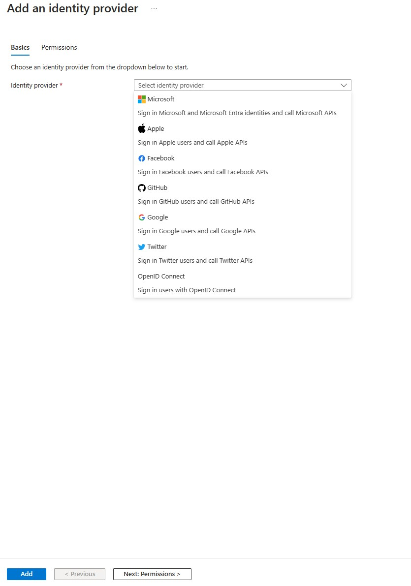
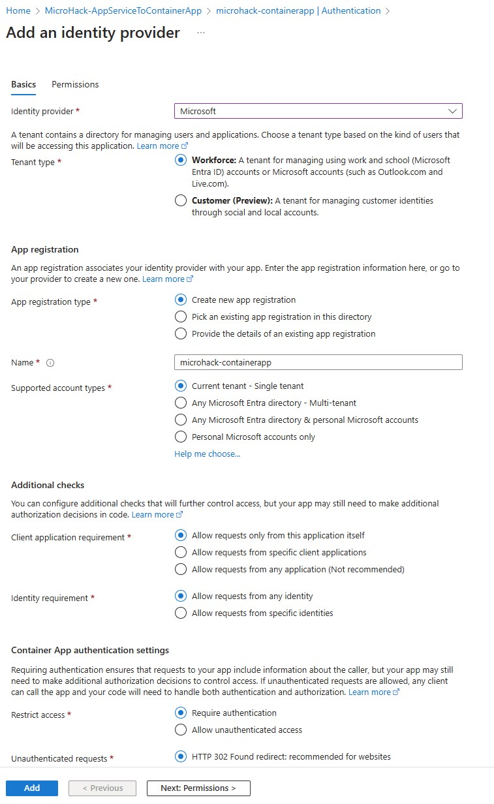

# Walkthrough Challenge 4 - Assess VM´s for the migration

Duration: 60 minutes

## Prerequisites

Please make sure thet you successfully completed [Challenge 3](../challenge-3/solution.md) before continuing with this challenge.

### **Task 1: Enable Authentication with Azure Entra ID**

You can quickly integrate an Azure Container App with Azure Entra ID (or any other OIDC identity provider like GitHub, Facebook, Google, etc.) without changing the implementation of the app. Simply go on the *Authentication* tab of the Container App and hit *Add identity provider*:

Select *Microsoft* as the ID provider:

Select `Workforce` as tenant type.
Select `Create new app registration`, name it something like "microhack-containerapp" and select `Current tenant - Single tenant` to create an App Registration in your Azure Entra ID tenant. Then mark the `Require authentication` to make sure only authenticated users can access the app. If the authentication fails, you can choose to which error page you want to redirect unauthenticated users. Hit *Add* to activate the authentication (this may take up to a minute in the background):

This will deploy a sidecar container to your app. Before a user can access the container that hosts your web app, the user has to authenticate against Azure Entra ID. You can open the app again to check if it works. Since you are probably already logged in with your Azure account, you might be authenticated automatically. If you open the app URL in private mode, you will see that authentication is required and log in with your Azure account.

### **Task 2: Enable Monitoring and Logging**

In production scenarios you want to know whats happening in your systems. Observabiliy is important. You can simply enable monitoring and logging for yout Azure Container Apps. Go to the *Logging options* of the Container Apps Environment in the portal and activate the `Azure Log Analytics` logging, then hit *Save* in the bottom:

You successfully completed challenge 4! 🚀🚀🚀

 **[Home](../../Readme.md)** - [Next Challenge Solution](../challenge-5/solution.md)
