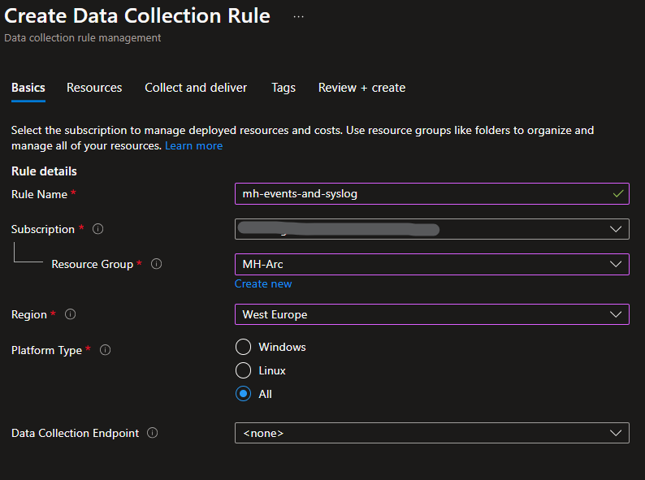
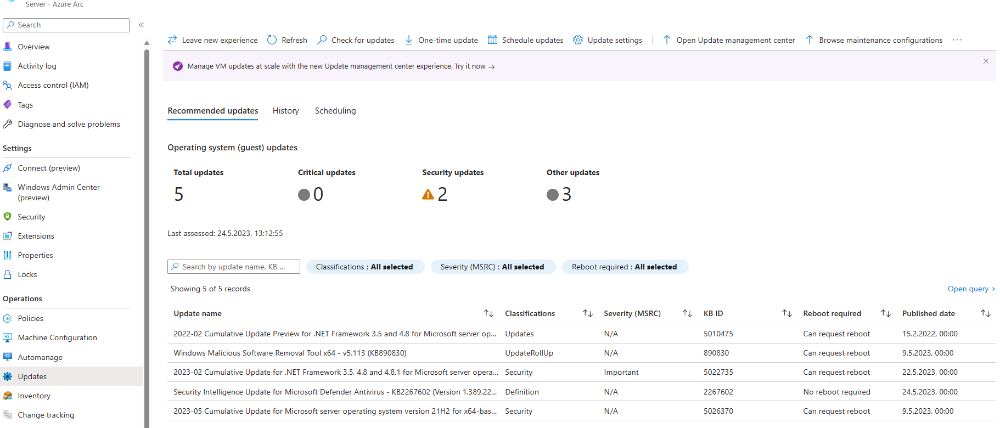

# Walkthrough Challenge 2 - Use Azure Monitor, Azure Update Management and Inventory for your Azure Arc enabled Servers

Duration: 30 minutes

[Previous Challenge Solution](../challenge-1/solution.md) - **[Home](../../Readme.md)** - [Next Challenge Solution](../challenge-3/solution.md)

## Prerequisites

Please ensure that you successfully passed [challenge 1](../../Readme.md#challenge-1) before continuing with this challenge.


### Task 1: Create all necessary Azure Resources (Log Analytics workspace)

1. Sign in to the [Azure Portal](https://portal.azure.com/).

2. Create a new Log Analytics Workspace called *mh-arc-servers-automation-law* with default settings in the same Resource Group.


***Please note**: For convenience, in this MicroHack create the Log Analytics workspace in the same resource group as you are using for your arc-enabled servers. Reason: The service pricinipal (used for remediation tasks) of the policy will be given the necessary RBAC roles on the scope where the policy is assigned. In this MicroHack we assume that every participant will assign the policy on resource group level. Hence, if the LAW is outside of that scope, you would need to assign the required permissions manually on the LAW.*


### Task 2: Configure Data Collection Rules in Log Analytics to collect Windows event logs and Linux syslog

1. Navigate to the Log Analytics Workspace and open *Agents* in the left navigation pane.

2. Select *Data Collection Rules* followed by a click on *Create* to create Data collection rules. 


3. Name the Data Collection Rule *mh-dcr* select your subscription and *mh-rg* as ressource group and change the Region to *West Europe*. Change Platform Type to *All* and click *Next: Resources* to continue.



4. Click on *Collect and deliver* as we going to set the scope of resources later on via Azure Policy. Click *Add data source*. For *Data source type* select *Windows Event Logs* and check the boxes of the log levels you would like to collect.

5. Click *Next: Destination* and *Add destination*. As *Destination type* select *Azure Monitor Logs* and in *Account or namespace* pick the Log Analytics workspace your created earlier. Click *Add data source*.


6. Repeat step 4 & 5 for Linux Syslog and accept the defaults.

7. Create the Data Collection Rule. 


### Task 3: Enable Azure Monitor for Azure Arc enabled Servers with Azure Policy initiative

1. Navigate to *Policy* using the top search bar and select *Assignments* in the left navigation pane.

2. Select *Assignments* in the left navigation pane and go to *Assign initiative*

3. In this section you can now configure the assignment with the following settings and create the assignment:

- Scope: Please select the resource group called *mh-arc-servers-rg*
- Basics: Please search for *Enable Azure Monitor for Hybrid VMs with AMA* and select the initiative.
- Parameters: Please insert the Resource ID of the Data Collection Rule from Task 2. 
- Remediation: Please select the System assigned identity location according to your resources, e.g. West Europe. 
- Click *Review + create* and then *Create*

4. Please wait around 30 seconds until the creation of the assignment is complete. You should see that the initiative is assigned. Every new Azure Arc server will now automatically install the AMA and Dependency agents as well the necessary association with the data collection rule we created in task 2. Be aware that agent installation can take up to 60 Minutes.


5. Important: Both machines were already onboarded earlier. As a result, you need to create a remediation task for each policy in the initiative to apply the policy to your existing Azure Arc Servers. Please select the Policy Assignment and select *Create Remediation Task*.


6. Accept the default values, check *Re-evaluate resource compliance before remediating* and repeat the remediation for the following policies:
 - AzureMonitorAgent_Windows_HybridVM_Deploy
 - AzureMonitorAgent_Linux_HybridVM_Deploy
 - DependencyAgentExtension_AMA_Windows_HybridVM_Deploy
 - DependencyAgentExtension_AMA_Linux_HybridVM_Deploy
 - DataCollectionRuleAssociation_Windows
 - DataCollectionRuleAssociation_Linux


7. In Policy > Remediation > Remediation Task, verify that all remediation completed successfully:


### Task 4: Enable and configure Update Management

1. Navigate to *Policy* using the top search bar and select *Assignments* in the left navigation pane.

2. Select *Assignments* in the left navigation pane and go to *Assign Policy*

3. In this section you can now configure the assignment with the following settings and create the assignment:

- Scope: Please select the resource group called *mh-arc-servers-rg*
- Basics: Please search for *Configure periodic checking for missing system updates on azure Arc-enabled servers* and select the policy. As *Assignment name* append *(Windows)* 
- Parameters: Skip, and keep defaults (which targeting Windows guest OS.)
- Remediation: Please select the System assigned identity location according to your resources, e.g. West Europe. 
- Click *Review + create* and then *Create*

4. Please wait a few seconds until the creation of the assignment is complete. You should see that the policy is assigned.

5. Repeat step 3 and 4 for the policy definition *Configure periodic checking for missing system updates on azure Arc-enabled servers*, apply the same configuration as in step 3 but this time unselect the checkbox at *Only show parameters that need input or review*, and change OS Type to *Linux*. Also append *(Linux)* in the *Assignment name* field.

6. Important: Both machines were already onboarded earlier. As a result, you need to create a remediation task to trigger the DeployIfNotExists effect of the policy to your Azure Arc Servers. Please select the policy assignment and select *Create Remediation Task*.

7. Accept the default values, check *Re-evaluate resource compliance before remediating* and repeat the remediation for the following policies:
 - Configure periodic checking for missing system updates on azure Arc-enabled servers (Windows)
 - Configure periodic checking for missing system updates on azure Arc-enabled servers (Linux)

8. Verify that all remediation were successful.

9. Navigate to Azure Arc, select Servers, repeat step 10 for your your Windows and Linux Server.

10. Select Updates. If there are no update information dispayed yet, click *Check for updates* and wait until missing updates appear. Then click on *One-time update* or *Schedule updates* if you would like to postpone the installation to a later point in time. (follow the wizzard).



11. After applying the updates point-in-time or via scheduler you should see the updates beeing installed on the system.


### Task 5: Enable Change Tracking and Inventory

In order to use the built-in policy initiative to enable *Change Tracking and Inventory* feature, we first need to create a special data collection rule. At the time of authoring this solution walkthrough, this is not possible using the Azure portal. But you can use the ARM template here: [/03-Azure/01-03-Infrastructure/02_Hybrid_Azure_Arc_Servers/resources/ChangeTracking/template-DCR-ChangeTracking.json](../../resources/ChangeTracking/template-DCR-ChangeTracking.json) to create this data collection rule.

In the custom ARM template, provide the following parameters:
| *Parameter*                           | *Value*                   |
|---------------------------------------|---------------------------|
| Resource group                        |  mh-arc-servers-rg        |
| Region                                | i.e. West Europe          |
| Data Collection Rule                  | leave the Default         |
| Log Analytics_workspace_ResourceId    | <paste the full resource id of the Log Analytics workspace you created in Task 1><br> i.e. /subscriptions/<*your-subscription-guid*>/resourcegroups/mh-arc-servers-rg/providers/microsoft.operationalinsights/workspaces/mh-arc-la|

In your command shell, navigate to the folder where the template is located and execute the following command:

```
 az deployment group create -g 'mh-arc-servers-rg' --template-file template-DCR-ChangeTracking.json --parameters logAnalytics_workspaces_ResourceId='/subscriptions/<your-subscription-guid>/resourcegroups/<your-resource-group-name>/providers/microsoft.operationalinsights/workspaces/<your-logAnalyticsWorkspace-name>'
```

Check whether the change tracking data collection rule as been created successfully and note the resource id (you will need it during the policy initiative assignment). Then create the policy assignment following these steps:

1. Navigate to *Policy* using the top search bar and select *Assignments* in the left navigation pane.

2. Select *Assignments* in the left navigation pane and click *Assign initiative*

3. In this section you can now configure the assignment with the following settings and create the assignment:

- Scope: Please select the resource group called *mh-arc-servers-rg*
- Basics: Please search for *[Preview]: Enable ChangeTracking and Inventory for Arc-enabled virtual machines* and select the initiative.
- Parameters: As *Data Collection Rule Resource Id* provide the resourceId of the data collection rule you just created in the beginning of this task - i.e. */subscriptions/<*your-subscription-guid*>/resourceGroups/mh-arc-servers-rg/providers/Microsoft.Insights/dataCollectionRules/DCR-ChangeTracking*.
- Remediation: Please select the System assigned identity location according to your resources, e.g. West Europe. 

4. Please wait a few seconds until the creation of the assignment is complete. You should see that the policy is assigned.

5. Important: Both machines were already onboarded earlier. As a result, you need to create a remediation tasks to apply all policies within the initiative to your Azure Arc Servers. Please select the Initiative Assignment and select *Create Remediation Task* for each policy.


6. Accept the default values, check *Re-evaluate resource compliance before remediating* and repeat the remediation for the following policies:
 - DeployAMALinuxHybridVMWithUAIChangeTrackingAndInventory
 - DCRALinuxHybridVMChangeTrackingAndInventory
 - DeployChangeTrackingExtensionLinuxHybridVM
 - DeployChangeTrackingExtensionWindowsHybridVM
 - DeployAMAWindowsHybridVMWithUAIChangeTrackingAndInventory
 - DCAWindowsHybridVMChangeTrackingAndInventory

8. Verify that all remediation were successful. This might take multiple minutes (or even hours).

9. Navigate to Azure Arc, select Servers, followed by selecting your Windows Server. Select Inventory. Please be aware that generating the initial inventory takes multiple Minutes/hours. After a while the white page should show values.


### Task 6: Enable VM Insights

1. Navigate to your Virtual Machines, in section *Monitoring* select *Insights* in the left navigation pane.

2. In the *Insights* tab, click the *Enable* button.

3. In the *Monitoring Configuration* form, for *Data collection rule* click the *Create New* link

4. Fill in the *Create new rule* form
- Data collection rule name: Provide a name (MSVMI for VMInsights will be appended automatically) - i.e. *DCR-MicroHack*
- Enable process and dependencies (Map): Check the box
- Subscription: Keep the default
- Log Analytics workspace: Choose the workspace you created in task 1
- Click *Create* button. Then click *Configure* button.

5. Wait for the deployment of the data collection rule to finish. This might take several minutes.


### Coffee Break of 10 minutes to let the data flow between your Virtual Machines and Azure

After your coffee break you should see that the Virtual Machines are reporting their status. You can now check the Update Management for pending updates, verify what software is installed on the machines and get deep insights of the utilization of your Virtual Machines.

You successfully completed challenge 2! 🚀🚀🚀
