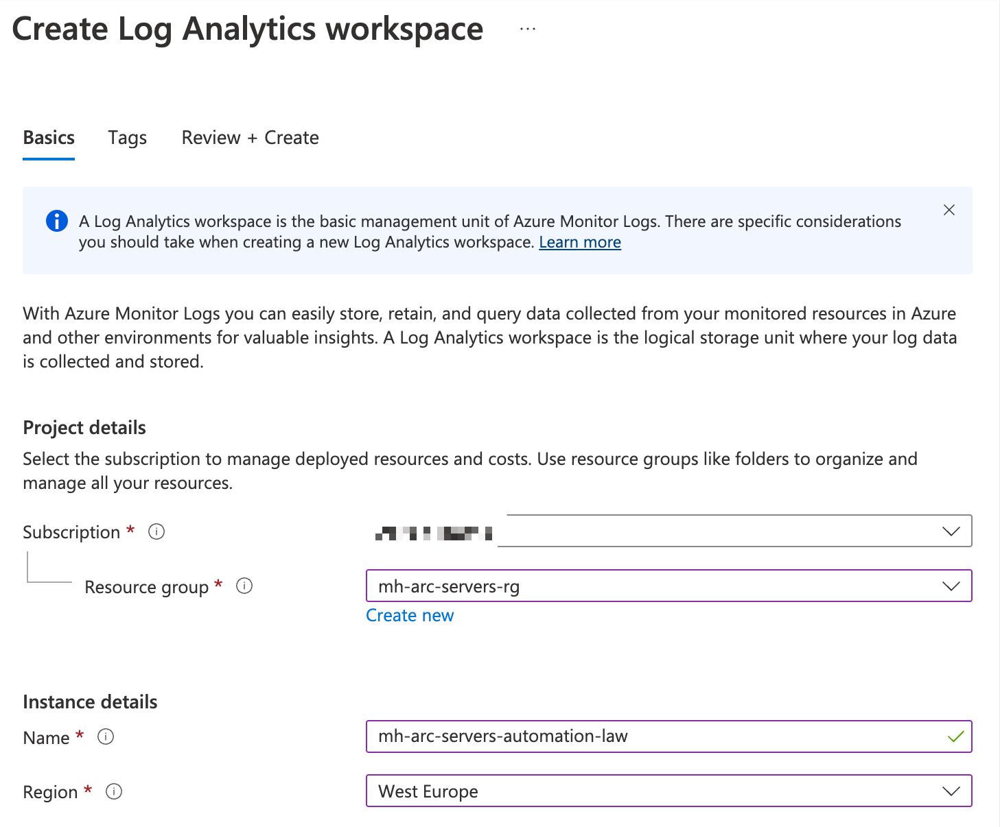
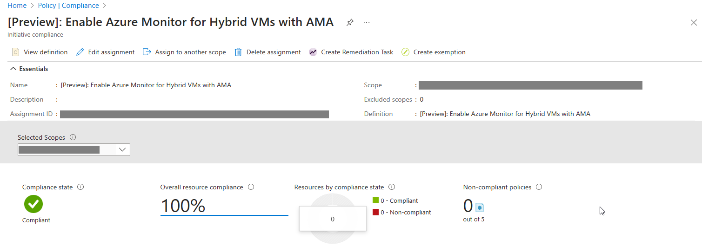
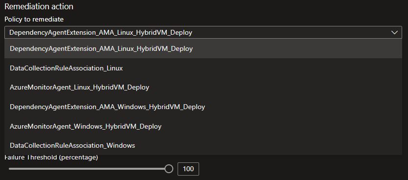
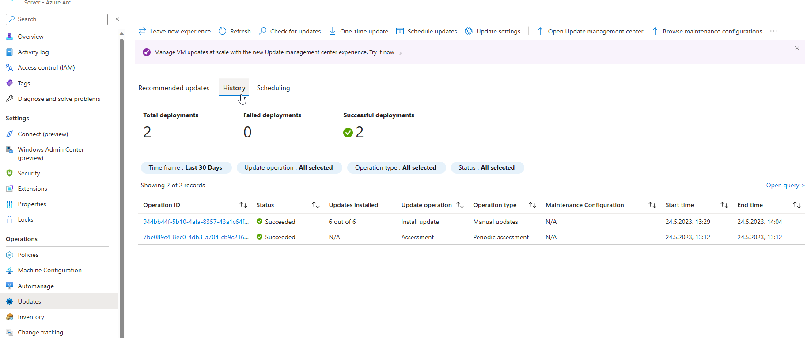
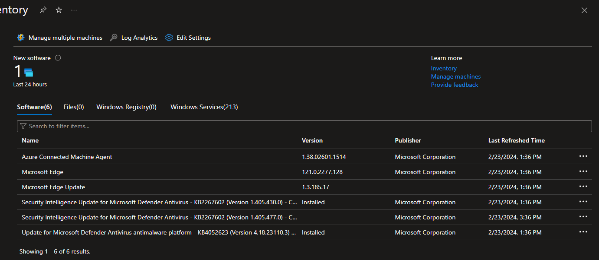

# Walkthrough Challenge 2 - Use Azure Monitor, Azure Update Management and Inventory for your Azure Arc enabled Servers

Duration: 30 minutes

[Previous Challenge Solution](../challenge-1/solution.md) - **[Home](../../Readme.md)** - [Next Challenge Solution](../challenge-3/solution.md)

## Prerequisites

Please ensure that you successfully passed [challenge 1](../../Readme.md#challenge-1) before continuing with this challenge.

### Task 1: Create necessary Azure resources

1. Sign in to the [Azure Portal](https://portal.azure.com/).

2. Create a new Log Analytics Workspace called *mh-arc-servers-automation-law* with default settings in the same Resource Group.

### Task 2: Configure Log Analytics

1. Navigate to the Log Analytics Workspace and open *Agents* in the left navigation pane.

2. Select *Data Collection Rules* followed by a click on *Create* to create Data collection rules. 

3. Name the Data Collection Rule *mh-dcr* select your subscription and *mh-rg* as ressource group and change the Region to *West Europe*. Change Platform Type to *All* and click *Next: Resources* to continue.

4. Click on *Next: Collect and deliver* as we going to set the scope of resources later on via Azure Policy. Select *Windows Event Logs* and check the boxes of the log levels you like to collect.

5. Continue on the second ribbon and configure the Destination for the Logs.

6. Repeat step 4 & 5 for Linux Syslog and accept the defaults.

7. Create the Data Collection Rule. 

### Task 3: Assign Azure Policy Initiative to your Azure Arc resource group

1. Navigate to *Policy* using the top search bar and select *Assignments* in the left navigation pane.

2. Select *Assignments* in the left navigation pane and go to *Assign initiative*

3. In this section you can now configure the assignment with the following settings and create the assignment:

- Scope: Please select the resource group called *mh-arc-servers-rg*
- Basics: Please search for *[Preview]: Enable Azure Monitor for Hybrid VMs with AMA* and select the initiative.
- Parameters: Please select your Log Analytics workspace. 
- Remediation: Please select the System assigned identity location according to your resources, e.g. West Europe. 

4. Please wait a few seconds until the creation of the assignment is complete. You should see that the initiative is assigned. Every new Azure Arc Server will now automatically install the necessary agents. Be aware that Agent installation can take up to 60 Minutes.

5. Important: Both machines were already onboarded earlier. As a result, you need to create a remediation task to apply the policy to your Azure Arc Servers. Please select the Policy Assignment and select *Create Remediation Task*.

6. Accept the default values, check *Re-evaluate resource compliance before remediating* and repeat the remediation for the following policies:
 - AzureMonitorAgent_Windows_HybridVM_Deploy
 - AzureMonitorAgent_Linux_HybridVM_Deploy
 - DependencyAgentExtension_AMA_Windows_HybridVM_Deploy
 - DependencyAgentExtension_Linux_HybridVM_Deploy
 - VMInsightsDCR_DCRA_HybridVM_Deploy

7. Verify that all remediation were successful.

### Task 4: Enable Update Management for Azure Arc enabled Servers via Azure Policy

1. Navigate to *Policy* using the top search bar and select *Assignments* in the left navigation pane.

2. Select *Assignments* in the left navigation pane and go to *Assign Policy*

3. In this section you can now configure the assignment with the following settings and create the assignment:

- Scope: Please select the resource group called *mh-arc-servers-rg*
- Basics: Please search for *[Preview]: Configure periodic checking for missing system updates on azure Arc-enabled servers* and select the policy.
- Parameters: Skip, and keep defaults. 
- Remediation: Please select the System assigned identity location according to your resources, e.g. West Europe. 

4. Please wait a few seconds until the creation of the assignment is complete. You should see that the policy is assigned.

5. Repeat Step 3 and 4 for the Policy definition *[Preview]: Configure periodic checking for missing system updates on azure Arc-enabled servers*, this time unselecting the Checkbox at Parameters, shifting OS Type to Linux.

6. Important: Both machines were already onboarded earlier. As a result, you need to create a remediation task to apply the policy to your Azure Arc Servers. Please select the Policy Assignment and select *Create Remediation Task*.

7. Accept the default values, check *Re-evaluate resource compliance before remediating* and repeat the remediation for the following policies:
 - Configure periodic checking for missing system updates on azure Arc-enabled servers_1
 - Configure periodic checking for missing system updates on azure Arc-enabled servers_2

8. Verify that all remediation were successful.

9. Navigate to Azure Arc, select Servers, followed by selecting your Windows or Linux Server.

10. Select Updates and click on One-time Update or create a Scheduled Update, if you like to postpone the installation to a later point in time. (follow the wizzard).

11. After applying the updates point-in-time or via scheduler you should see the updates beeing installed on the system.

### Task 5: Enable Inventory and Change Tracking for Azure Arc enabled Servers

1. Navigate to *Policy* using the top search bar and select *Assignments* in the left navigation pane.

2. Select *Assignments* in the left navigation pane and go to *Assign Policy*

3. In this section you can now configure the assignment with the following settings and create the assignment:

- Scope: Please select the resource group called *mh-arc-servers-rg*
- Basics: Please search for *[Preview]: Configure Windows Arc-enabled machines to install AMA for ChangeTracking and Inventory* and select the policy.
- Parameters: Skip, and keep defaults. 
- Remediation: Please select the System assigned identity location according to your resources, e.g. West Europe. 

4. Please wait a few seconds until the creation of the assignment is complete. You should see that the policy is assigned.

5. Important: Both machines were already onboarded earlier. As a result, you need to create a remediation task to apply the policy to your Azure Arc Servers. Please select the Policy Assignment and select *Create Remediation Task*.

6. Accept the default values, check *Re-evaluate resource compliance before remediating* and repeat the remediation for the following policies:
 - [Preview]: Configure Windows Arc-enabled machines to install AMA for ChangeTracking and Inventory

8. Verify that all remediation were successful.

9. Navigate to Azure Arc, select Servers, followed by selecting your Windows Server. Select Inventory. Please be aware that generating the initial inventory takes multiple Minutes/hours. After a while the white page should show values.

### Task 6: Analyze data in VM Insights

1. Navigate to your Virtual Machines, select VM Insights in the left navigation pane and enable Insights.

### Coffee Break of 10 minutes to let the data flow between your Virtual Machines and Azure

After your coffee break you should see that the Virtual Machines are reporting their status. You can now check the Update Management for pending updates, verify what software is installed on the machines and get deep insights of the utilization of your Virtual Machines.

You successfully completed challenge 2! 🚀🚀🚀
