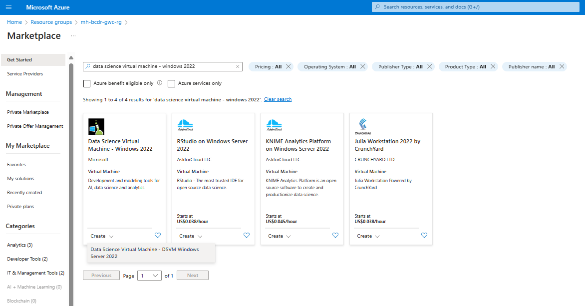
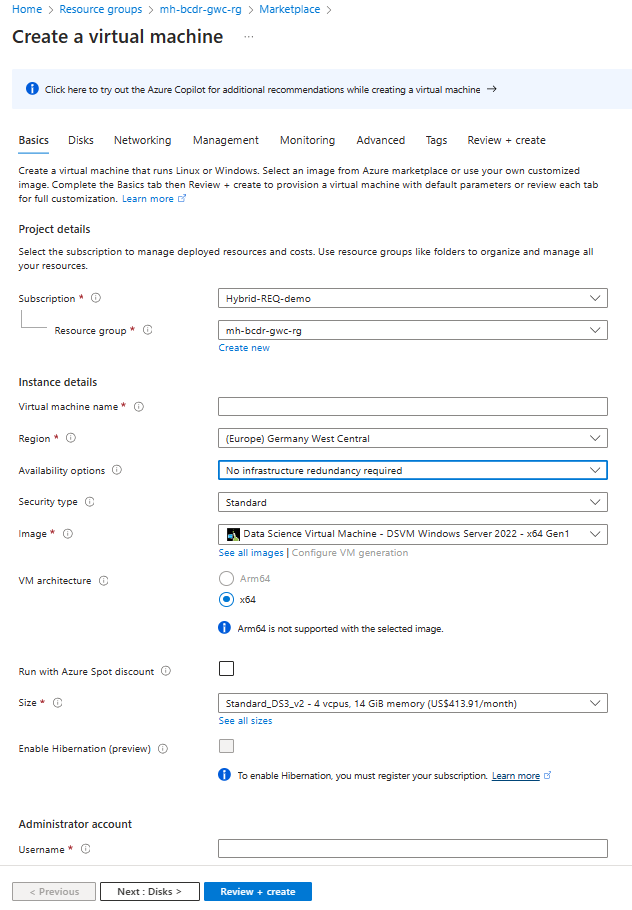
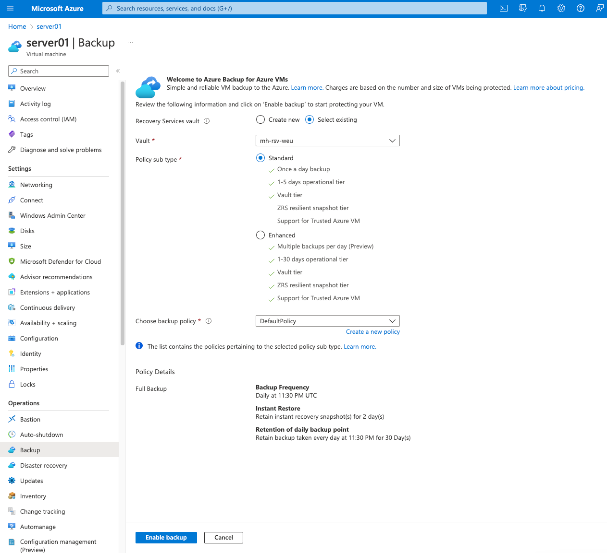
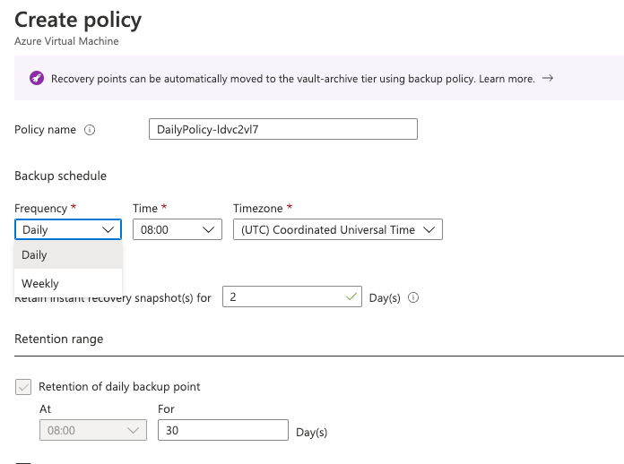
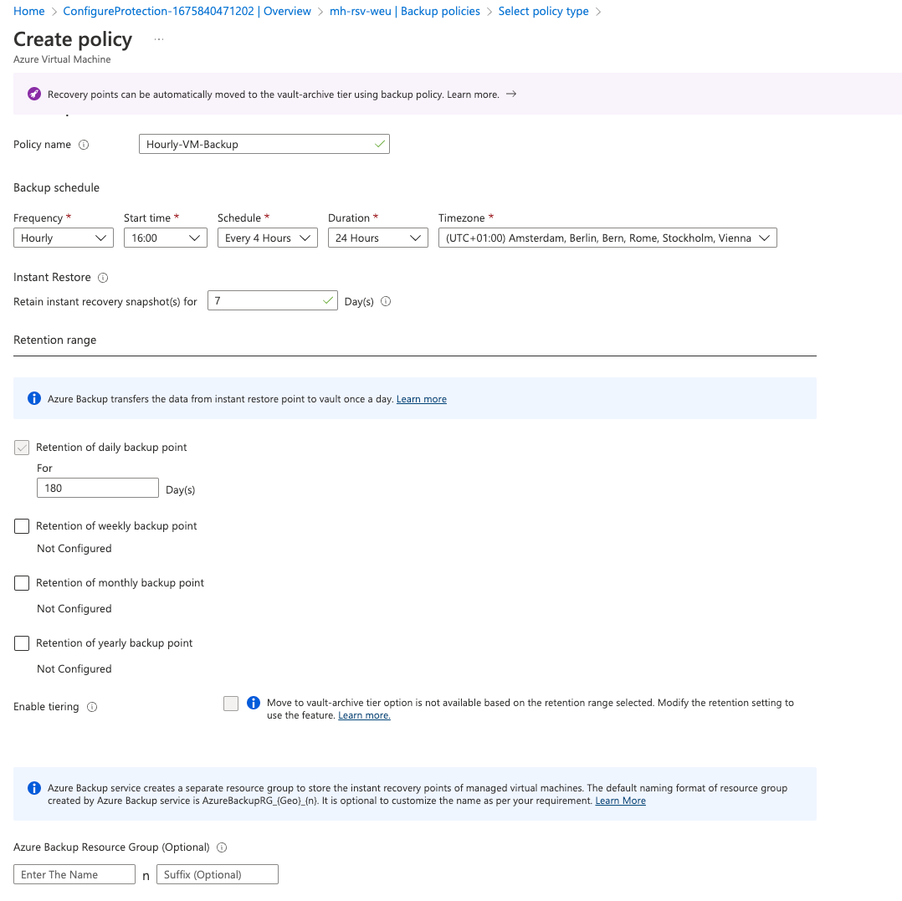
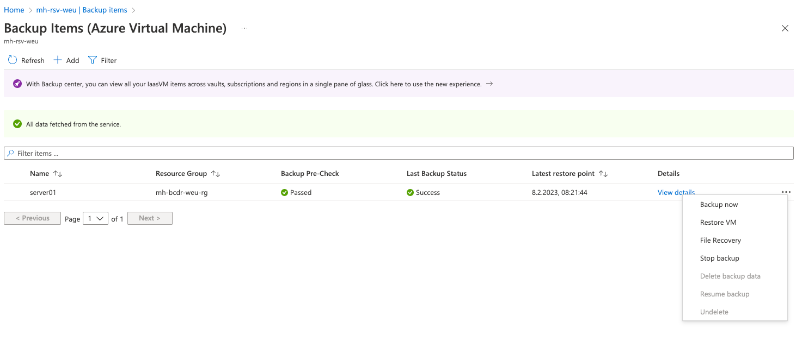
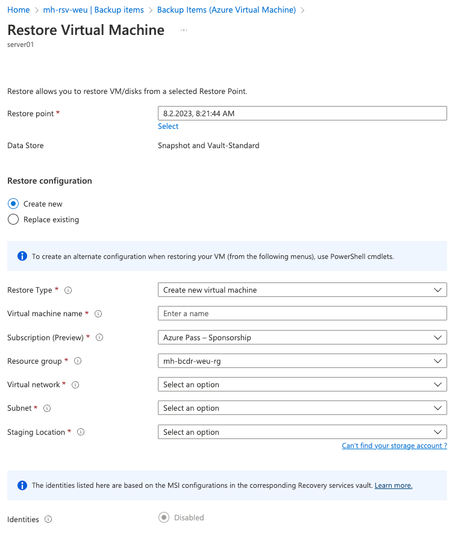

# Walkthrough Challenge 2 - Protect in Azure - Backup/Restore

Duration: 30 minutes

[Previous Challenge Solution](../challenge-1/solution.md) - **[Home](../../Readme.md)** - [Next Challenge Solution](../challenge-3/solution.md)

## Prerequisites

Please ensure that you successfully passed [challenge 1](../../Readme.md#challenge-1) before continuing with this challenge.

In this challenge you will successfully onboard your Windows and Linux Virtual Machines to a centralized Recovery Services Vault and leverage Azure Backup Center to Protect with Backup in Azure. 

### Actions

* Deploy a Windows Server 2022 VM in Germany West Central Resource Group. Please use the "Data Science Virtual Machine - Windows 2022" image from the market place.
> **Note:** The 'Data Science Virtual Machine (DSVM)' is a 'Windows Server 2022 with Containers' VM that has several popular tools for data exploration, analysis, modeling & development pre installed.
> You will to use Microsoft SQL Server Management Studio to connect to the database and Storage Explorer to the storage Account.
* Deploy a Ubuntu Server VM in Sweden Central Resource Group
* Deploy a azure sql database server with a database containing the sample data of AdventureWorksLT.
* From the Data Science Windows Server VM, connect to the database  and to the storage account.
* Create a blob container and upload a sample file to it
* Enable Azure Backup for both VMs
* Enable Azure Backup for blobs on the storage account.
* Restore a VM in Azure
* Delete and restore the sample blob file

### Task 1: Create a new Virtual Machine in Azure Region Germany West Central

As a first step, we will create a VM (Name: ds-vm-win-serverl) in Azure in the resource group "mh-bcdr-gwc-rg" that we created in the last challenge. This should be a Data Science Virtual Machine - Windows 2022 using a VM Type of Standard DS3v2. 

### Choose OS

### Configure Details - Basics

### Configure Details - Basics (option 2)

Please don't forget to put the VM into the public network and open up Port 3389 to connect to it (or alternatively use Azure Bastion to access it). 
### Enable RDP Port

### Review deployed VM

### Task 2: Deploy a Ubuntu Server VM in Norh Europe Resource Group
The steps for the Ubunutu Server VM are similar to this and will not be included here.

### Task 3: Enable Azure Backup for both VMs

### Enable Azure Backup

### Create a new Custom Policy

### Review additional Deployment Options

### Review additional Deployment Options

### Wait for intial Backup of the VM

The steps for the Ubuntu Server VM are similar to this and will not be included here.

### Task 4: Restore a VM in Azure

### Start Restore Procedure

### Select restore Point

### Set Restore Properties

You successfully completed challenge 3! 🚀🚀🚀
