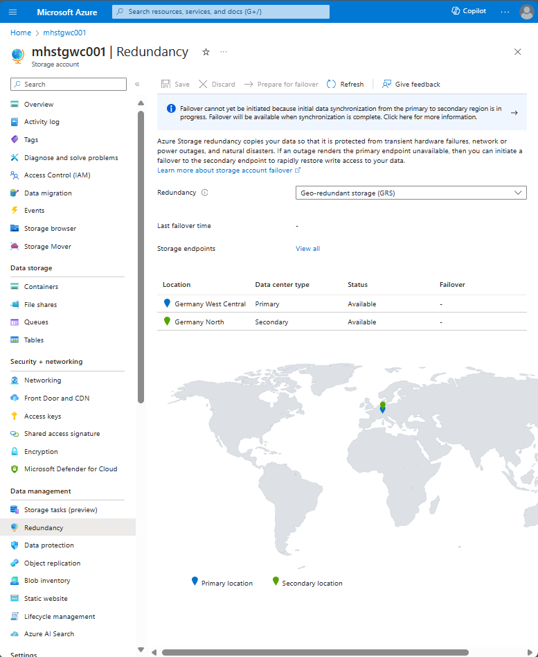

# Walkthrough Challenge 4 - Protect your Azure PaaS (Azure SQL Database and Storage Account) with Disaster recovery

Duration: 50 minutes

[Previous Challenge Solution](../challenge-3/solution.md) - **[Home](../../Readme.md)** - [Next Challenge Solution](../challenge-5/solution.md)

## Prerequisites

Please ensure that you successfully passed [challenge 3](../../Readme.md#challenge-3) before continuing with this challenge.

In challenge 4, you will focus on implementing disaster recovery strategies for Azure SQL databases using Failover Groups and for Azure storage accounts. The primary objective is to ensure business continuity by protecting critical data stored in Azure SQL databases and Azure storage accounts against potential disasters.

### Actions
* Implement Failover Groups for Azure SQL Database:
  * Task 1: Create a Failover Group between two Azure SQL databases located in different Azure regions (Germany West central and Sweden Central).
  * Task 2: Configure automatic failover policies and test the failover mechanism to ensure seamless transition in case of a disaster.
* Disaster Recovery for Azure Storage Account:
  * Task 1: Set up and configure Azure Storage Account replication to another region using Geo-redundant storage (GRS) or Geo-zone-redundant storage (GZRS) to ensure data availability in case of regional outages.
  * Task 2: Perform a failover test for the storage account to validate the disaster recovery setup.

### Learning resources
* [Azure SQL Database Failover Groups and Active Geo-Replication](https://learn.microsoft.com/en-us/azure/azure-sql/database/auto-failover-group-overview)
* [Testing for disaster recovery](https://learn.microsoft.com/en-us/azure/site-recovery/site-recovery-test-failover-to-azure)

### Solution

### Implement Failover Groups for Azure SQL Database

## Task 1: Create a Failover Group between two Azure SQL databases located in different Azure regions (Germany West central and Sweden Central)

## Task 2: Configure automatic failover policies and test the failover mechanism to ensure seamless transition in case of a disaster.

### Disaster Recovery for Azure Storage Account

### Learning resources
* [Geo-redundant storage (GRS) for cross-regional durability](https://learn.microsoft.com/en-us/azure/storage/common/storage-redundancy-grs)
* [Disaster recovery and storage account failover](https://learn.microsoft.com/en-us/azure/storage/common/storage-disaster-recovery-guidance)

## Task 1: Set up and configure Azure Storage Account replication to another region using Geo-redundant storage (GRS) or Geo-zone-redundant storage (GZRS) to ensure data availability in case of regional outages.

Navigate to the **Azure Storage Account** in the Germany West Central Region. Open the tab **Redundancy**:

### Choose Geo-redundant storage (GRS) as redundancy option. This will enable cross-replication of your storage account with the paired region Germany North. 

## Task 2: Perform a failover test for the storage account to validate the disaster recovery setup.

### Run the test failover from Germany West Central to the Sweden Central Region

**You successfully completed challenge 4!** 🚀🚀🚀
