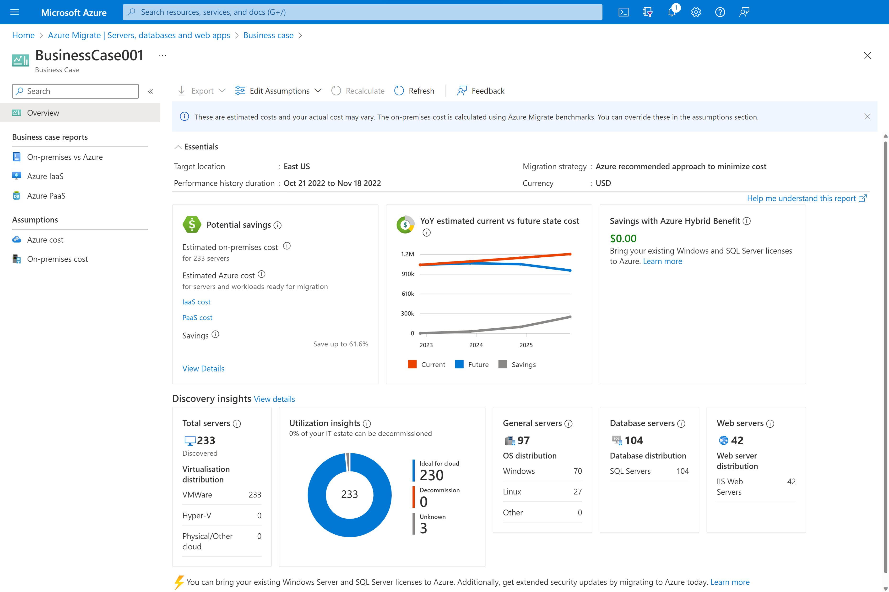
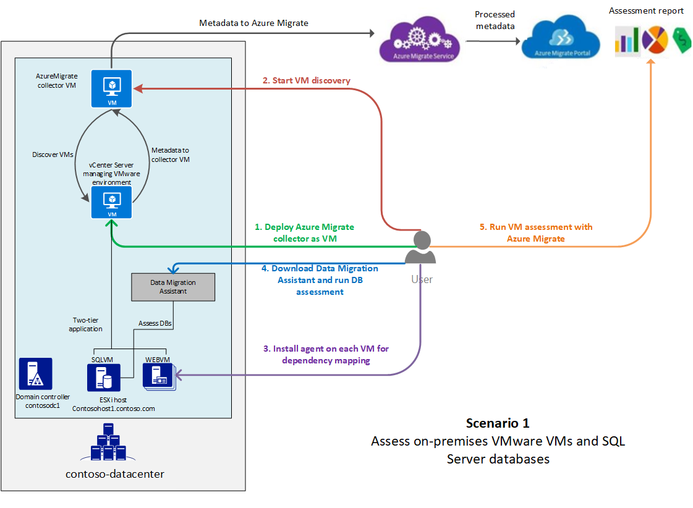

# **Migration & Datacenter Modernization MicroHack**

- [**MicroHack introduction**](#MicroHack-introduction)
- [**MicroHack context**](#microhack-context)
- [**Objectives**](#objectives)
- [**MicroHack Challenges**](#microhack-challenges)
- [**Contributors**](#contributors)

# MicroHack introduction

This MicroHack scenario walks through the process how to optimize and modernize you datacenter. The assessment, the tooling and processes are global best practices and with a focus on the real world scenarios, cost optimization and the best customer recommended design principles. Specifically, this builds up to include working with an existing infrastructure.

<!---->
<!---->

This lab is not a full explanation of building up a migration factory or a program to modernize your processes and dependencies. Please consider the following articles required pre-reading to build foundational knowledge.

* [Understand the security baseline from Azure Migrate](https://learn.microsoft.com/en-us/security/benchmark/azure/baselines/azure-migrate-security-baseline?context=%2Fazure%2Fmigrate%2Fcontext%2Fmigrate-context)
* [Build a migration plan](https://learn.microsoft.com/en-us/azure/migrate/concepts-migration-planning)
* [Assessment overview VM´s](https://learn.microsoft.com/en-us/azure/migrate/concepts-assessment-calculation)
* [Assessment overview App Service](https://learn.microsoft.com/en-us/azure/migrate/concepts-azure-webapps-assessment-calculation)
* [Assessment overview SQL](https://learn.microsoft.com/en-us/azure/migrate/concepts-azure-sql-assessment-calculation)

Optional (read this after completing this lab to take your learning even deeper!)
* [Web apps migration support](https://learn.microsoft.com/en-us/azure/migrate/concepts-migration-webapps)
* [Support matrix for vSphere migration](https://learn.microsoft.com/en-us/azure/migrate/migrate-support-matrix-vmware-migration)
* [VMWare agentless migration architecture](https://learn.microsoft.com/en-us/azure/migrate/concepts-vmware-agentless-migration)
* [Support matrix for Hyper-V migration](https://learn.microsoft.com/en-us/azure/migrate/migrate-support-matrix-hyper-v-migration)
* [Hyper-V migration architecture](https://learn.microsoft.com/en-us/azure/migrate/hyper-v-migration-architecture)
* [Troubleshooting guide](https://learn.microsoft.com/en-us/azure/migrate/troubleshoot-general)

# MicroHack context
This MicroHack scenario walks through the use of Azure Migrate to support the process and the different phases of datacenter modernization: 

- Discover
- Decide
- Assess
- Migrate
- Modernize

As part of the MicroHack, we will simulate the discovery and migration of physical servers to Azure. We will create the source systems as Azure Virtual Machines within a dedicated source Resource Group in Azure to simulate the on-prem datacenter. We will use Azure Migrate to discover, assess and migrate the systems into a destination Resource Group that simulates the target Azure environment.

The concept behind physical server discovery and migration is described in detail under the following links:
* [Physical Server discovery](https://learn.microsoft.com/en-us/azure/migrate/migrate-support-matrix-physical)
* [Physical Server migration](https://learn.microsoft.com/en-us/azure/migrate/migrate-support-matrix-physical-migration)

# Objectives

After completing this MicroHack you will:

- Know how to build an assessment & business case for you datacenter transformation 
- Understand the default and best practices how to quickly migrate workloads and safe with right sizing
- Understand how to use the tools and best practices to optimize and safe time
- Know how to not only use the tools to Lift & Shift, you will also understand how to modernize to cloud native services

# MicroHack challenges

## General prerequisites

This MicroHack has a few but important prerequisites

In order to use the MicroHack time most effectively, the following prerequisites should be completed prior to starting the session.

* Azure Active Directory Tenant
* At least one Azure Subscription
* Azure Active Directory user with Contributor or Owner permissions on the Azure Subscription

With these pre-requisites in place, we can focus on building the differentiated knowledge in Azure Migrate that is required when working with the product.

## Challenge 1 - Prerequisites and landing zone preparation

### Goal

- Deploy a *source* resource group with two VMs and their dependencies that act as our physical on-premise servers that will be migrated to Azure.
- Deploy a *destination* resource group to which the servers will be migrated.

### Actions

- Deploy the [Bicep configuration](./resources) of the Micro Hack.

### Success criteria

- You have understood the concept and architecture for the MicroHack.
- The Bicep deployment command exits successfully.
- The *source* and *destination* resource group is visible in the Azure Portal.

### Learning resources

- [What is Bicep?](https://learn.microsoft.com/en-us/azure/azure-resource-manager/bicep/overview?tabs=bicep)

### Solution - Spoilerwarning

[Solution Steps](./walkthrough/challenge-1/solution.md)

## Challenge 2 - Discover physical servers for the migration

### Goal 

The goal of this exercise is to...

* Setup Azure Migrate Project in Azure
* Installing / Deploying the necessary setup for discovery 
* Create a discovery 

### Actions

* Create a Azure Migrate Project
    - 💥 **To be able to create a Business Case, make sure to select Europe as the Geography for the Azure Migrate Project** 
* Deploy a Azure Migrate Appliance
    - 💥 **Carfully select the appropriate OS for the Azure Migrate Appliance. Windows Server 2016 is officially supported. Windows Server 2019 will work as well. Windows Server 2022 does not work yet.**
* Create a continous disvovery of your source environment

### Success criteria

* You have created a Azure Migrate Project
* You have successfully deployed the Azure Migrate Appliance
* You successfully registerd the Azure Migrate Appliance with the Azure Migrate Project
* You have successfully setup a continuous discovery for the physical servers.
* You have successfully verified the discovered servers in the portal

### Learning resources
* [Create and managed Azure Migrate projects](https://learn.microsoft.com/en-us/azure/migrate/create-manage-projects)
* [Setup and appliance on VMWare](https://learn.microsoft.com/en-us/azure/migrate/how-to-set-up-appliance-vmware)
* [Setup and appliance on Hyper-V](https://learn.microsoft.com/en-us/azure/migrate/how-to-set-up-appliance-hyper-v)
* [Steup an appliance for physical servers](https://learn.microsoft.com/en-us/azure/migrate/how-to-set-up-appliance-physical)
* [Before you start / general prerequisites](https://learn.microsoft.com/en-us/azure/migrate/how-to-discover-applications#before-you-start) 

### Solution - Spoilerwarning

[Solution Steps](./walkthrough/challenge-2/solution.md)

## Challenge 3 - Create a Business Case

The Business case capability helps you build a business proposal to understand how Azure can bring the most value to your business. 

It highlights:

- On-premises vs Azure total cost of ownership.
- Year on year cashflow analysis.
- Resource utilization based insights to identify servers and workloads that are ideal for cloud.
- Quick wins for migration and modernization including end of support Windows OS and SQL versions.
- Long term cost savings by moving from a capital expenditure model to an Operating expenditure model, by paying for only what you use.

Other key features:

- Helps remove guess work in your cost planning process and adds data insights driven calculations.
- It can be generated in just a few clicks after you have performed discovery using the Azure Migrate appliance.
- The feature is automatically enabled for existing Azure Migrate projects.

### Goal 

The goal of this exercise is to create a business case. The Business case capability helps you build a business proposal to understand how Azure can bring the most value to your business. It highlights:

- On-premises vs Azure total cost of ownership.
- Year on year cashflow analysis.
- Resource utilization based insights to identify servers and workloads that are ideal for cloud.
- Quick wins for migration and modernization including end of support Windows OS and SQL versions.
- Long term cost savings by moving from a capital expenditure model to an Operating expenditure model, by paying for only what you use.

💥 **The Business case capability is currently in public preview** 

### Actions

* Builde a business case 
* Review a business case
* Adjust business case assumptions

### Success criteria

* You successfully build a business case
* You have successfully reviewed the business case
* You understand how to adjust the business case assumptions

### Learning resources
* [Business case overview](https://learn.microsoft.com/en-us/azure/migrate/concepts-business-case-calculation)
* [Build a business case](https://learn.microsoft.com/en-us/azure/migrate/how-to-build-a-business-case)
* [Review a business case](https://learn.microsoft.com/en-us/azure/migrate/how-to-view-a-business-case)

### Solution - Spoilerwarning

[Solution Steps](./walkthrough/challenge-3/solution.md)

## Challenge 4 - Assess VM´s for the migration

In most cases, you don't want to migrate all machines at once, but want to prioritize workload by workload and even understand what the dependencies between workloads are. You then look at each phase or wave of migration and break down the risks and workloads.

### Goal 

The goal of this exercise is to ...

* measure the readiness and estimates the effect of migrating on-premises servers to Azure
* review the assessment output to understand the readiness and sizing recommendations
* review the dependencies between the discovered servers

### Actions

* Group machines for the assessment
* Create an Azure VM assessment
* Review assessment output and reccomendations
* Enable and review dependency analysis

### Success criteria

* You created a machine group
* You successfully created an Azure VM assessment
* You reviewed the assessment output and reccomendations
* You enabled and reviewed the dependencies of the discovered server

### Learning resources
* [Assessment overview - To Azure VMs](https://learn.microsoft.com/en-us/azure/migrate/concepts-assessment-calculation)
* [Select assessment tools](https://learn.microsoft.com/en-us/azure/migrate/how-to-assess)
* [Create a group for assessment](https://learn.microsoft.com/en-us/azure/migrate/how-to-create-a-group)
* [Create an Azure VM assessment](https://learn.microsoft.com/en-us/azure/migrate/how-to-create-assessment)
* [Customize an assessment](https://learn.microsoft.com/en-us/azure/migrate/how-to-modify-assessment)

### Solution - Spoilerwarning

[Solution Steps](./walkthrough/challenge-4/solution.md)

## Challenge 5 - Migrate machines to Azure

### Goal 

The goal of this exercise is to ...

* understand the different migration options and prerequisites provided by Azure Migrate
* perfrom a test migration of the desired workload
* keep downtime as short as possible
* perform the final migration towards Azure

### Actions

* Setup the Azure Replication Appliance
* Deploy the Mobility Service Agent
* Replicate the machines to Azure
* Perform a Test Migration
* Prepare the final Migration
* Migrate the workload to Azure

### Success criteria

* All the soruce machines are successfully migrated to and running in Azure
* The Web Servers are seamlessley accessable using a Traffic Manager profile via dedicated Public Load Balancer.

### Learning resources
* [Support matrix for migration of physical servers, AWS VMs, and GCP VMs](https://learn.microsoft.com/en-us/azure/migrate/migrate-support-matrix-physical-migration)
* [Migrate Hyper-V VM´s to Azure](https://learn.microsoft.com/en-us/azure/migrate/tutorial-migrate-hyper-v)
* [Migrate options for VMWare to Azure](https://learn.microsoft.com/en-us/azure/migrate/server-migrate-overview)
* [Migrate Physical Servers](https://learn.microsoft.com/en-us/azure/migrate/tutorial-migrate-physical-virtual-machines)
* [Migrate AWS Instances to Azure](https://learn.microsoft.com/en-us/azure/migrate/tutorial-migrate-aws-virtual-machines)
* [Migrate GCP Instances to Azure](https://learn.microsoft.com/en-us/azure/migrate/tutorial-migrate-gcp-virtual-machines)

### Solution - Spoilerwarning

[Solution Steps](./walkthrough/challenge-5/solution.md)

## Challenge 6 - Modernize with Azure

### Goal 

The goal of this exercise is to ...

* modernize the Web App running on the frontend Servers to be hosted on PaaS instead of IaaS (Lift & Shift)
* understand the options that ware avaiulable for App Sevrice assessment & migration

### Actions

* Create an web app assessment using Azure Migrate
* Perfom a web app migration using Azure Migrate towards Azure App Services

### Success criteria

* An assessment has been performed using the already deployed infrastructre
* An migration has been performed towards PaaS instead of IaaS
* The App Services are accessible using the source Load Balancer.

💥 **The new App Service migration capability is currently in public preview** 

💥 **For the current version (June 2023) of the App Service migration scripts Basic Authentication on Azure Web Apps is a hard requirement. Make sure that no Azure Policy restrictions are in place that prohibit the use of Basic Authentication for Azure App Services**

### Learning resources
* [App Service assessment overview](https://learn.microsoft.com/en-us/azure/migrate/concepts-azure-webapps-assessment-calculation)
* [Web App migration support](https://learn.microsoft.com/en-us/azure/migrate/concepts-migration-webapps)
* [Public preview: App Service new migration capabilities](https://azure.microsoft.com/en-us/updates/public-preview-app-service-new-migration-capabilities/)
* [App Service migration PowerShell scripts](https://github.com/Azure/App-Service-Migration-Assistant/wiki/PowerShell-Scripts)

### Solution - Spoilerwarning

[Solution Steps](./walkthrough/challenge-6/solution.md)

## Finish

Congratulations! You finished the MicroHack for Migration and Modernization. We hope you had the chance to learn about the how to implement a successful migration strategy using Azure Migrate.
If you want to give feedback please dont hesitate to open an Issue on the repository or get in touch with one of us directly.

Thank you for investing the time and see you next time!

## Contributors
* Nils Bankert [GitHub](https://github.com/nilsbankert); [LinkedIn](https://www.linkedin.com/in/nilsbankert/)
* Andreas Schwarz [LinkedIn](https://www.linkedin.com/in/andreas-schwarz-7518a818b/)
* Christian Thönes [Github](https://github.com/cthoenes); [LinkedIn](https://www.linkedin.com/in/christian-t-510b7522/)